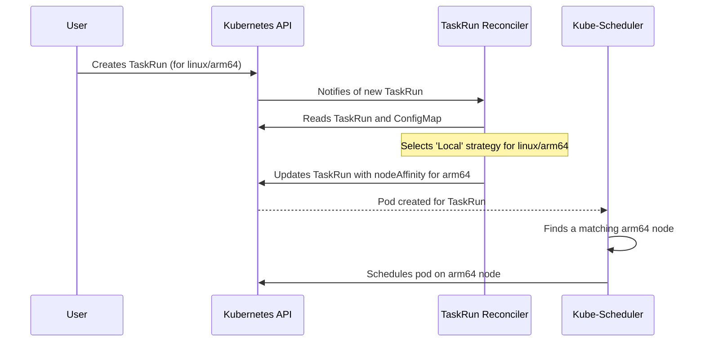
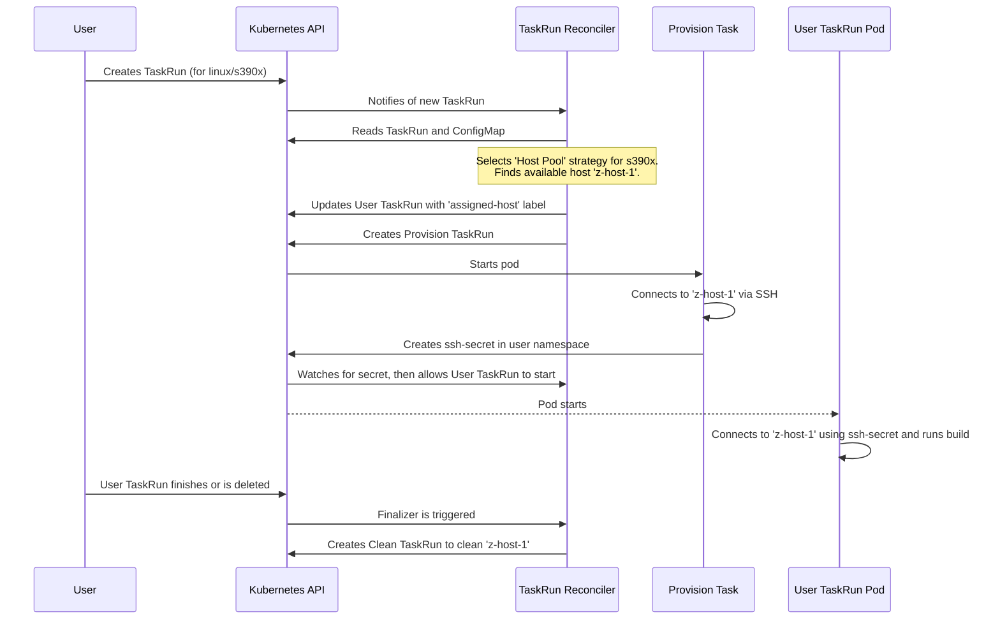
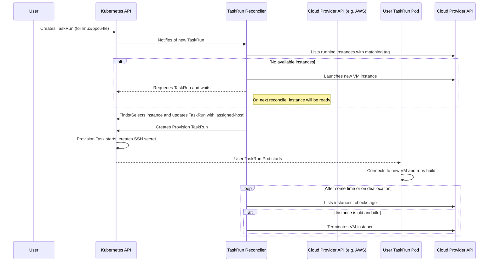

# TaskRun Reconciler and Provisioning Strategies

> :warning: this document is AI-generated and can contain errors :warning:

The `TaskRun` reconciler is responsible for watching `TaskRun` resources within the Kubernetes cluster and taking action to provide a suitable execution environment if the `TaskRun` is designated for a specific platform (e.g., `linux/arm64`, `linux/s390x`).

## General Reconciliation Logic

The reconciliation process can be broken down into the following high-level steps:

1.  **TaskRun Reception**: The reconciler's main entry point (`Reconcile`) receives a request for a `TaskRun`. It fetches the `TaskRun` object.

2.  **Task Type Dispatching**: The reconciler first determines if the `TaskRun` is a **user task** (a build or CI task submitted by a user) or an **internal task** (a task created by the controller itself for management purposes). This is done by checking for the `build.appstudio.redhat.com/task-type` label.
    *   **Internal tasks** like `provision`, `clean`, and `update` have their own handling logic. For example, a `clean` task is responsible for de-provisioning a host after a user task is complete.
    *   If it's a **user task**, and it requires a multi-platform host (identified by the presence of a special secret and a `PLATFORM` parameter), the main provisioning logic is triggered.

3.  **Host Allocation**: For a user task requiring a specific platform, the reconciler needs to allocate a host.
    *   If a host is already assigned (indicated by the `build.appstudio.redhat.com/assigned-host` label), the reconciler ensures the provisioning `TaskRun` that sets up the host has completed successfully.
    *   If no host is assigned, the reconciler proceeds to allocate one based on the configuration.

4.  **Configuration and Strategy Selection**: The core of the allocation logic resides in the `readConfiguration` function. This function reads a central `ConfigMap` named `multi-platform-config` in the operator's namespace. This `ConfigMap` defines which provisioning strategy to use for each platform. Based on the requested platform (e.g., `linux/arm64`), the reconciler selects one of three strategies:
    *   **Local**: The `TaskRun` is scheduled on a local Kubernetes node that matches the platform.
    *   **Host Pool**: The `TaskRun` is assigned a pre-configured, static remote host from a pool.
    *   **Dynamic Pool**: A new virtual machine is dynamically provisioned on a cloud provider to run the `TaskRun`.

5.  **Delegation to Strategy**: Once the strategy is selected, the reconciler calls the `Allocate` method on the corresponding strategy's implementation (`LocalPool`, `HostPool`, or `DynamicHostPool`).

This modular design allows for different provisioning mechanisms to be used for different platforms, all managed by the same controller.

## Provisioning Strategies

### 1. Local Provisioning

This is the simplest strategy. It's used when the Kubernetes cluster itself has nodes that can satisfy the platform requirement.

**Logic:**
The `LocalPool` strategy doesn't provision any new machines. Instead, it modifies the user's `TaskRun` to ensure it gets scheduled on an appropriate node within the cluster. It does this by adding a `nodeAffinity` to the `TaskRun's` pod template, forcing it to run on a node with a matching `kubernetes.io/arch` label.

Here is a diagram illustrating the local provisioning flow:

### 2. Host Pool (Static) Provisioning

This strategy is used when you have a fixed set of pre-configured remote machines (bare metal or VMs) that can be shared among `TaskRuns`. These hosts are defined in the `multi-platform-config` `ConfigMap`.

**Logic:**
The `HostPool` strategy manages a pool of hosts with a defined concurrency level (i.e., how many tasks can run on a host simultaneously).

1.  **Selection**: When a `TaskRun` needs a host, the `HostPool.Allocate` method scans the list of available hosts for the requested platform. It calculates the current load on each host by counting existing `TaskRuns` assigned to it. It then selects the host with the most available slots.
2.  **Waiting**: If all suitable hosts are at full capacity, the `TaskRun` is labeled as `waiting-for-platform` and the reconciler will try again later.
3.  **Provisioning Task**: Once a host is selected, the `TaskRun` is assigned to it via a label. The reconciler then launches a *new, internal* `TaskRun` (a "provision task"). This provision task connects to the remote host via SSH and creates a new `Secret` in the user's namespace. This `Secret` contains the SSH credentials that the original user `TaskRun` will use to connect to its build environment.
4.  **Deallocation**: After the user's `TaskRun` completes, a finalizer triggers the `HostPool.Deallocate` method. This kicks off a "clean task" `TaskRun`, which is responsible for cleaning up any resources on the remote host.

This approach allows for controlled access to a shared pool of static resources.

Here is a diagram illustrating the static host pool provisioning flow:

### 3. Dynamic Pool Provisioning

This is the most flexible and scalable strategy. It provisions new virtual machines on-demand from a configured cloud provider (e.g., AWS, IBM Cloud) when a `TaskRun` needs a specific platform.

**Logic:**
The `DynamicHostPool` strategy essentially creates a temporary `HostPool` from actively running cloud instances and adds new instances to that pool as needed.

1.  **Check Existing Instances**: When a `TaskRun` needs a host, the `Allocate` method first asks the configured cloud provider for a list of all currently running VMs that have a specific tag. This list of active VMs is treated as a temporary `HostPool`.
2.  **Attempt to Allocate**: The reconciler then attempts to allocate a spot on one of these existing VMs, using the same concurrency and selection logic as the static `HostPool` strategy.
3.  **Launch New Instance**: If no existing VMs have capacity, or if there are no running VMs for that platform, the reconciler checks if it is allowed to provision a new one (i.e., if the total number of instances is below the configured maximum). If so, it makes an API call to the cloud provider to launch a new VM.
4.  **Requeue and Re-evaluate**: The reconciler does not wait for the VM to be ready. It simply requeues the `TaskRun`. On a subsequent reconciliation, the new VM (once booted) will appear in the list of active instances and will be allocated to the `TaskRun`. From this point, the flow mirrors the `HostPool` strategy: a "provision task" creates an SSH secret, allowing the user's `TaskRun` to connect.
5.  **Instance Culling**: This strategy includes a mechanism to automatically terminate old or idle VMs. Each time it lists the instances, it checks their age. If a VM is older than the configured `maxAge` and is not currently running any tasks, the reconciler will make an API call to the cloud provider to terminate it, preventing resource leakage.

This strategy combines the benefits of on-demand provisioning with the efficiency of reusing running instances for multiple tasks.

Here is a diagram illustrating the dynamic pool provisioning flow:

